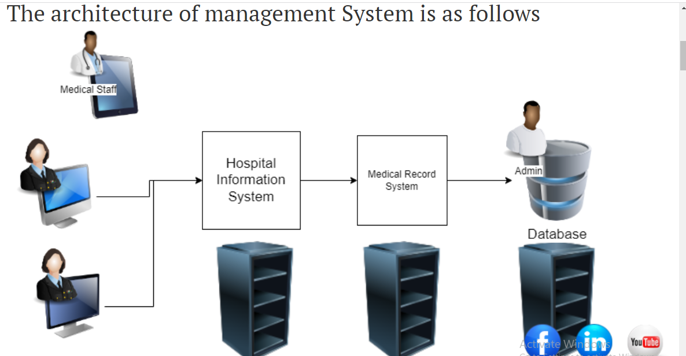

            MONITORING

(checking our services is working or not )getting o know about the problems
* now lets try to figure out any failure
    * network failure
    * harware "
    * application "

 suppose you are assigned to figure out failures . to slove the issues we wil figureout a proactive approach
    for every one min.
    check if every server is responding or not
    check if application is responding or not
    alert if the servers or applications are not responding

logs: log is a record which specify some activity done 

* OS have log we might need to  finetune it
        windows = event viewer
        linux= syslog
* application also log try to uderstand about failure
 * log debug: to findout the errors in the logs(logs will appreare)
 * log info :  checking the logs whether it's present or not

* TRACING:
  it's an approch to figure out the flow of your system
  every s/m has resource utilization informations
        * cpu
        * memory
        * disk
        * network
METRICS:

  metrics are the values which reprasents some information about s/m
  or application with value as number with time dymention(x-axis time, y-axis value)

  * for example we can the qtinfo s/m need to monitoring the solutions we need to get (logs , metric, trace)
  * MTTR: mean time to recover(avarage time taken by ur organization to       recover from failures)
  * MTTF: meantime to fail (avg time during the certain toget an failure in ur s/m)
    * SLA: service level agriment(this is an agriment b/w service provider and customer w.r.t  availability and other importent metricks)
